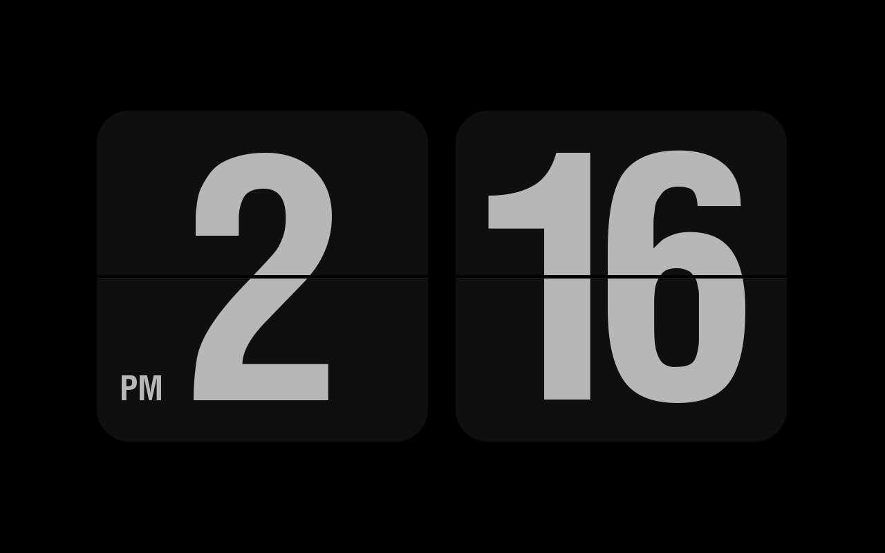

# gluqlo

* [Overview](#overview)
* [Usage](#usage)
* [Installation](#installation)

## Overview
**A beautiful clock and screensaver for Raspberry Pi**



## Usage
If you want to use Gluqlo as a screensaver, you may need to go to Menu ---> Settings ---> Screensaver and select "Gluqlo" from screensaver menu. 
If you want to use Gluqlo as a desktop clock, you may need to go to Menu ---> Accessories and select "Gluqlo clock" from menu. 

## Installation
```bash
curl -sSfL https://raw.githubusercontent.com/mapi68/gluqlo/master/gluqlo-install | bash
```


